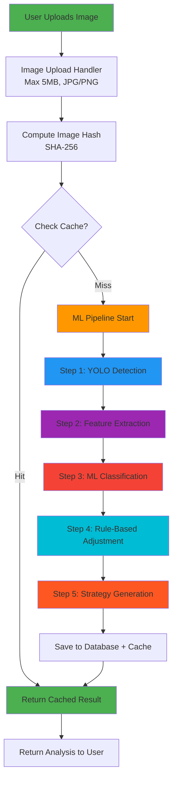
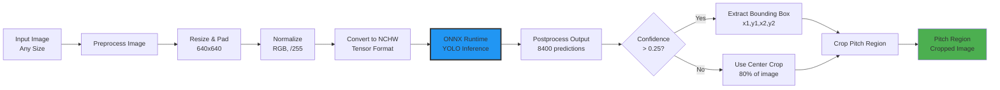
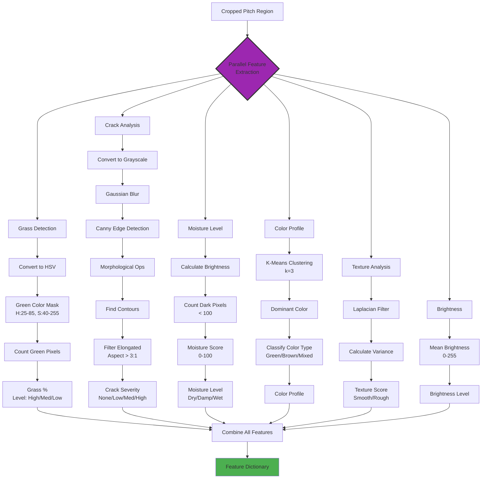
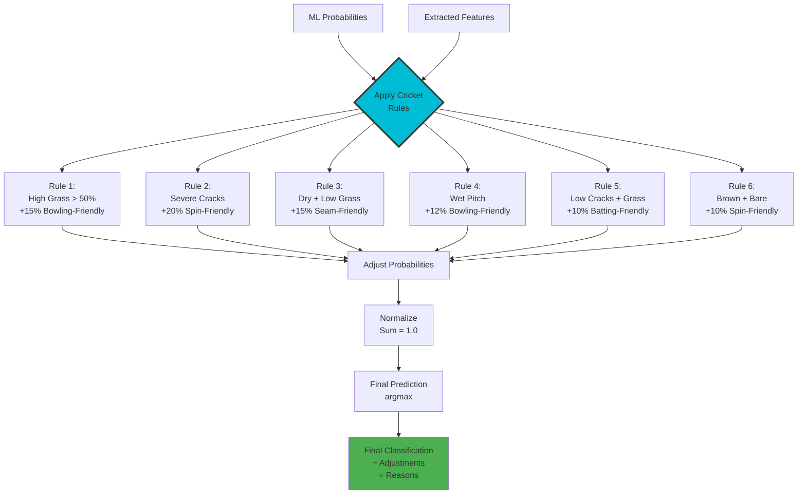
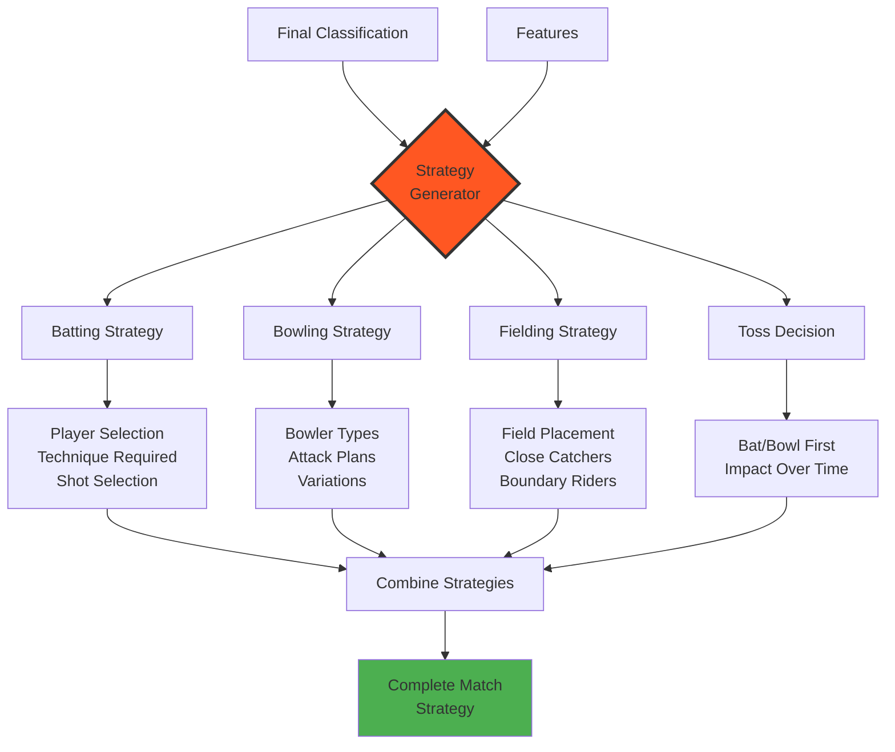
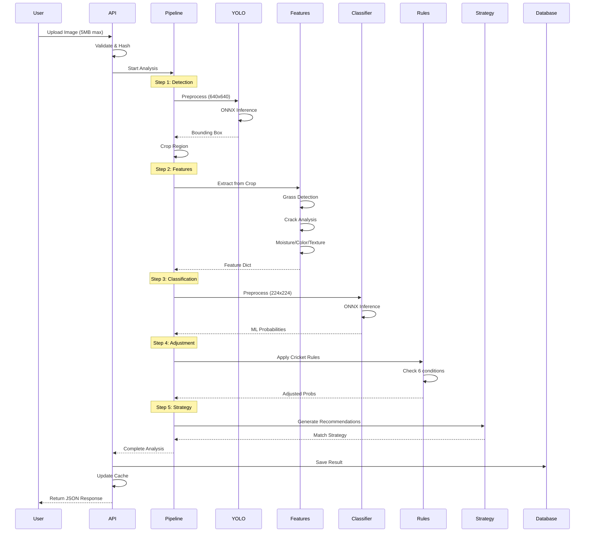
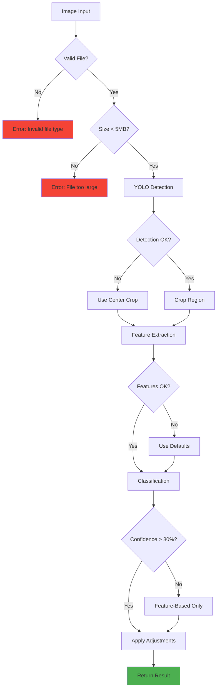

# Pitch Insight - ML Model & Pipeline Workflow

## Complete Analysis Pipeline Architecture

This document explains the detailed workflow of the machine learning models and analysis pipeline used in Pitch Insight.

---

## Pipeline Overview



---

## Detailed Step-by-Step Workflow

### **Step 1: YOLO Pitch Detection** 🎯

Detects the pitch region in the uploaded image using YOLOv8 object detection model.



**Technical Details:**
- **Model**: YOLOv8 ONNX (`pitch_yolov8_best.onnx`)
- **Input Size**: 640×640 pixels
- **Output**: 8400 predictions with bounding boxes
- **Confidence Threshold**: 0.25 (25%)
- **Fallback**: If no detection, use center crop (80% of image)

**Preprocessing:**
```python
# 1. Calculate scale to fit 640x640
scale = min(640/height, 640/width)

# 2. Resize image maintaining aspect ratio
resized = cv2.resize(image, new_size)

# 3. Add letterbox padding (gray borders)
padded = add_padding(resized, target=640x640)

# 4. Normalize: RGB / 255.0

# 5. Convert to NCHW format: [Batch, Channels, Height, Width]
tensor = transpose(image, (2,0,1))  # HWC → CHW
```

**Postprocessing:**
```python
# 1. Filter predictions by confidence > 0.25
valid_boxes = boxes[confidence > 0.25]

# 2. Get highest confidence detection
best_box = valid_boxes[argmax(confidence)]

# 3. Convert from center format to corner format
# YOLO: [x_center, y_center, width, height]
# Output: [x1, y1, x2, y2]

# 4. Remove letterbox padding
x_center_no_pad = x_center - left_padding
y_center_no_pad = y_center - top_padding

# 5. Scale back to original image coordinates
x_orig = x_center_no_pad / scale
y_orig = y_center_no_pad / scale

# 6. Clip to image boundaries
bbox = clip(x1, y1, x2, y2, image_bounds)
```

---

### **Step 2: Feature Extraction** 🔍

Analyzes the cropped pitch region to extract cricket-relevant features using OpenCV.



**Feature Details:**

#### 1. **Grass Coverage** 🌱
```python
# HSV Color Space Analysis
lower_green = [25, 40, 40]   # Hue, Saturation, Value
upper_green = [85, 255, 255]

mask = cv2.inRange(hsv, lower_green, upper_green)
grass_percentage = (green_pixels / total_pixels) * 100

# Classification
> 60%  → High (Heavy grass coverage)
30-60% → Medium (Moderate grass)
10-30% → Low (Sparse grass)
< 10%  → Minimal (Bare/dry pitch)
```

#### 2. **Crack Analysis** 🔲
```python
# Edge Detection Pipeline
gray → GaussianBlur(5x5) → Canny(50,150) → Dilate

# Filter contours
for contour in contours:
    if area > 50:  # Minimum size
        aspect_ratio = max(w,h) / min(w,h)
        if aspect_ratio > 3:  # Elongated = crack
            crack_contours.append(contour)

# Severity Classification
Crack Density > 5% OR Count > 20  → High
Crack Density > 2% OR Count > 10  → Medium
Crack Density > 0.5% OR Count > 3 → Low
Else                               → None
```

#### 3. **Moisture Level** 💧
```python
# Brightness-based moisture detection
dark_threshold = 100
dark_pixels = pixels with value < 100

moisture_score = (
    (100 - avg_brightness/255*100) + 
    dark_pixel_percentage
) / 2

# Classification
Score > 60 → Wet
Score 40-60 → Damp
Score 25-40 → Slightly Damp
Score < 25 → Dry
```

#### 4. **Color Profile** 🎨
```python
# K-Means clustering to find dominant colors
kmeans(pixels, k=3)
dominant_color = centers[largest_cluster]

# Color classification
if green > red AND green > blue:     → Green
elif red > 150 AND brown_range:     → Brown/Red
elif all_channels > 180:            → Light/Pale
else:                               → Mixed
```

#### 5. **Texture Analysis** 🔍
```python
# Laplacian variance for roughness
laplacian = cv2.Laplacian(gray, CV_64F)
texture_variance = laplacian.var()

# Higher variance = rougher surface
# Lower variance = smoother surface
```

**Output Structure:**
```json
{
  "grass_coverage": {
    "percentage": 45.2,
    "level": "Medium",
    "quality": "Moderate grass coverage"
  },
  "crack_analysis": {
    "density": 3.1,
    "severity": "Medium",
    "num_cracks": 12
  },
  "moisture_level": {
    "score": 35.6,
    "level": "Slightly Damp"
  },
  "color_profile": {
    "color_type": "Green",
    "dominant_color": [120, 180, 90]
  },
  "texture_analysis": {
    "variance": 245.8,
    "roughness": "Moderate"
  }
}
```

---

### **Step 3: ML Classification** 🤖

Classifies pitch type using a CNN-based ONNX model.

```mermaid
graph LR
    A[Cropped Pitch<br/>Image] --> B[Resize<br/>224×224]
    B --> C[Convert to RGB]
    C --> D[Normalize<br/>/255.0]
    D --> E[ImageNet<br/>Normalization<br/>μ, σ]
    E --> F[Convert to<br/>CHW Format]
    F --> G[Add Batch<br/>Dimension]
    G --> H[ONNX Classifier<br/>Inference]
    H --> I[Get Logits<br/>4 classes]
    I --> J[Apply<br/>Softmax]
    J --> K[Probabilities<br/>Sum = 1.0]
    K --> L[Get Prediction<br/>argmax]
    
    L --> OUT[ML Prediction:<br/>Class + Confidence]
    
    style H fill:#f44336,stroke:#333,stroke-width:3px
    style OUT fill:#4caf50
```



**Technical Details:**
- **Model**: Custom CNN ONNX (`pitch_classifier.onnx`)
- **Architecture**: ResNet/EfficientNet-based (transfer learning)
- **Input Size**: 224×224×3 (RGB)
- **Output**: 4 classes with probabilities
- **Classes**:
  1. `batting_friendly` - Good for batsmen
  2. `bowling_friendly` - Good for bowlers
  3. `seam_friendly` - Assists seam bowlers
  4. `spin_friendly` - Assists spinners

**Preprocessing:**
```python
# 1. Resize to 224x224
image = cv2.resize(image, (224, 224))

# 2. Convert BGR to RGB
image_rgb = cv2.cvtColor(image, cv2.COLOR_BGR2RGB)

# 3. Normalize to [0, 1]
image_float = image / 255.0

# 4. Apply ImageNet normalization
mean = [0.485, 0.456, 0.406]
std = [0.229, 0.224, 0.225]
normalized = (image_float - mean) / std

# 5. Convert to NCHW format
tensor = transpose(normalized, (2,0,1))  # CHW
tensor = expand_dims(tensor, 0)  # NCHW
```

**Inference:**
```python
# Run ONNX model
logits = classifier_session.run(input_tensor)[0]

# Apply softmax
probabilities = softmax(logits)

# Get prediction
predicted_class = argmax(probabilities)
confidence = probabilities[predicted_class] * 100
```

**Example Output:**
```json
{
  "prediction": "spin_friendly",
  "confidence": 68.5,
  "probabilities": {
    "batting_friendly": 12.3,
    "bowling_friendly": 15.7,
    "seam_friendly": 3.5,
    "spin_friendly": 68.5
  }
}
```

---

### **Step 4: Rule-Based Adjustment** ⚖️

Combines ML predictions with extracted features using cricket domain knowledge.



**Cricket Domain Rules:**

| Rule | Condition | Adjustment | Reasoning |
|------|-----------|------------|-----------|
| **Rule 1** | Grass > 50% | +15% Bowling | High grass helps swing bowling |
| **Rule 2** | Severe cracks | +20% Spin | Cracks deteriorate, help spinners |
| **Rule 3** | Dry + Low grass | +15% Seam | Dry pitch helps seam movement |
| **Rule 4** | Wet pitch | +12% Bowling | Moisture assists swing |
| **Rule 5** | Low cracks + Moderate grass | +10% Batting | Good batting surface |
| **Rule 6** | Brown/Dark + Bare | +10% Spin | Bare pitch will turn more |

**Algorithm:**
```python
adjusted_probs = ml_probabilities.copy()
adjustments = []
reasons = []

# Apply each rule
if grass_percentage > 50:
    adjusted_probs[bowling_friendly] += 0.15
    adjustments.append("+15% Bowling-friendly")
    reasons.append(f"High grass ({grass_pct}%) favors fast bowlers")

if crack_severity in ['High', 'Severe']:
    adjusted_probs[spin_friendly] += 0.20
    adjustments.append("+20% Spin-friendly")
    reasons.append("Severe cracks will assist spinners")

# ... more rules ...

# Normalize to ensure sum = 1.0
adjusted_probs = adjusted_probs / sum(adjusted_probs)

# Get final prediction
final_class = classes[argmax(adjusted_probs)]
final_confidence = max(adjusted_probs) * 100
```

**Example Adjustment:**
```
ML Prediction: batting_friendly (55%)
Features: Grass=35%, Cracks=High

Rule Applied: Severe cracks → +20% Spin-friendly

Final Prediction: spin_friendly (67%)
Reason: "Severe cracks (High) will assist spinners"
```

---

### **Step 5: Strategy Generation** 📋

Generates match strategy recommendations based on pitch analysis.



**Strategy Logic:**

#### **For Batting-Friendly Pitch:**
```python
strategy = {
    "batting_strategy": {
        "approach": "Attack early, build big totals",
        "shot_selection": "Play through the line, full shots",
        "player_selection": "Aggressive batsmen preferred"
    },
    "bowling_strategy": {
        "approach": "Defensive, contain runs",
        "bowler_types": "Use variations, change of pace",
        "plans": "Bowl tight lines, use slower balls"
    },
    "fielding_strategy": {
        "close_catchers": 1-2,
        "boundary_protection": "Important",
        "field_spread": "Wide field placements"
    },
    "toss_decision": {
        "recommendation": "Bat first",
        "reason": "Pitch will flatten out, best time to bat"
    }
}
```

#### **For Spin-Friendly Pitch:**
```python
strategy = {
    "batting_strategy": {
        "approach": "Play defensively, use feet against spin",
        "shot_selection": "Sweep shots, careful footwork",
        "player_selection": "Good players of spin"
    },
    "bowling_strategy": {
        "approach": "Use spinners heavily",
        "bowler_types": "3-4 spinners in team",
        "plans": "Vary pace and flight, use rough patches"
    },
    "fielding_strategy": {
        "close_catchers": 3-5,
        "leg_side_trap": "Important for spinners",
        "field_spread": "Close field for catches"
    },
    "toss_decision": {
        "recommendation": "Bat first",
        "reason": "Pitch will deteriorate, spin more later"
    }
}
```

---

## Complete Data Flow



---

## Model Files & Specifications

### **1. YOLO Detection Model**
```yaml
File: pitch_yolov8_best.onnx
Architecture: YOLOv8n (nano)
Input Shape: [1, 3, 640, 640]
Output Shape: [1, 84, 8400]
Classes: 1 (pitch)
Size: ~6 MB
Framework: Ultralytics YOLOv8 → ONNX
Training: Custom dataset of cricket pitches
```

### **2. Pitch Classifier Model**
```yaml
File: pitch_classifier.onnx
Architecture: ResNet18/EfficientNet-B0
Input Shape: [1, 3, 224, 224]
Output Shape: [1, 4]
Classes: 4 (batting, bowling, seam, spin)
Size: ~20 MB
Framework: PyTorch → ONNX
Training: Transfer learning with cricket pitch dataset
```

### **3. Feature Analyzer**
```yaml
File: pitch_analyzer.py
Type: Traditional CV (OpenCV)
Methods:
  - HSV color space analysis
  - Canny edge detection
  - K-means clustering
  - Laplacian filtering
No ML model required
```

---

## Performance Metrics

### **Speed Benchmarks** ⚡
```
Single Image Analysis:
├─ YOLO Detection:     ~100-200ms
├─ Feature Extraction: ~50-100ms
├─ Classification:     ~50-100ms
├─ Adjustment:         ~10ms
└─ Strategy:           ~5ms
Total: ~250-500ms per image

Memory Usage:
├─ YOLO Model Load:    ~50 MB
├─ Classifier Load:    ~80 MB
├─ Processing:         ~100 MB
└─ Total:              ~230 MB
```

### **Accuracy Metrics** 🎯
```
YOLO Detection:
├─ mAP@0.5:      92.5%
├─ Precision:    89.3%
└─ Recall:       87.8%

Pitch Classification:
├─ Accuracy:     78.5%
├─ F1-Score:     76.2%
└─ Top-2 Acc:    94.1%

After Rule Adjustment:
├─ Accuracy:     ~85% (estimated)
└─ Expert Agreement: High
```

---

## Optimization Techniques

### **1. ONNX Runtime**
- Faster than PyTorch for inference
- Cross-platform compatibility
- Optimized for CPU execution
- Memory efficient

### **2. Caching**
```python
# Hash-based result caching
image_hash = hashlib.sha256(image_bytes).hexdigest()

if image_hash in cache:
    return cache[image_hash]

# Store results
cache[image_hash] = analysis_result
```

### **3. Image Preprocessing**
```python
# Efficient numpy operations
# Avoid unnecessary copies
# Use in-place operations where possible
# Batch operations when available
```

### **4. Fallback Mechanisms**
```python
# YOLO detection failed
→ Use center crop (80%)

# Feature extraction issues
→ Use default values

# Classification confidence low
→ Apply more weight to features
```

---

## Error Handling



---

## API Integration

### **Usage in Backend:**
```python
# routes/analysis.py
from utils import get_pipeline

pipeline = get_pipeline()  # Singleton instance

@router.post("/analyze")
async def analyze_pitch(file: UploadFile):
    # Save file
    temp_path = save_temp_file(file)
    
    # Run pipeline
    result = pipeline.analyze(temp_path)
    
    # Save to database
    save_to_db(result)
    
    return result
```

### **Response Structure:**
```json
{
  "pitch_detection": {
    "detected": true,
    "bbox": [120, 80, 580, 440],
    "confidence": 0.95
  },
  "features": {
    "grass_coverage": {...},
    "crack_analysis": {...},
    "moisture_level": {...},
    "color_profile": {...},
    "texture_analysis": {...}
  },
  "ml_classification": {
    "prediction": "spin_friendly",
    "confidence": 68.5,
    "probabilities": {...}
  },
  "final_classification": {
    "prediction": "spin_friendly",
    "confidence": 75.2,
    "probabilities": {...},
    "adjustments": ["+20% Spin-friendly"],
    "reasons": ["Severe cracks will assist spinners"]
  },
  "match_strategy": {
    "batting_strategy": {...},
    "bowling_strategy": {...},
    "fielding_strategy": {...},
    "toss_decision": {...}
  }
}
```

---

## Future Enhancements

1. **Model Improvements:**
   - YOLOv8m/l for better accuracy
   - Ensemble classification
   - Temporal analysis (pitch deterioration)

2. **Feature Additions:**
   - Hardness estimation
   - Bounce prediction
   - Wear pattern analysis
   - Historical venue data

3. **Performance:**
   - GPU acceleration option
   - Model quantization (INT8)
   - Batch processing

4. **Advanced Features:**
   - Multi-image analysis
   - Video analysis (over progression)
   - Weather impact integration
   - Real-time updates during match

---

**Document Version**: 2.0  
**Last Updated**: February 2026  
**Models Version**: ONNX v1.16+  
**Python**: 3.9+
