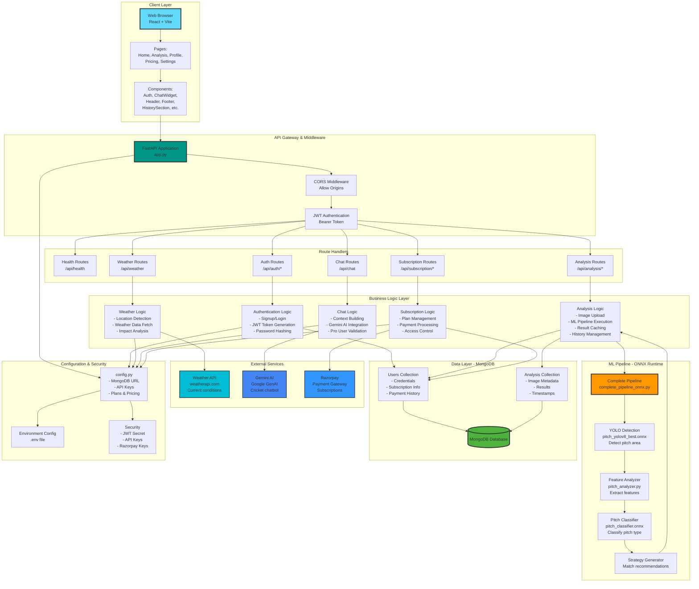
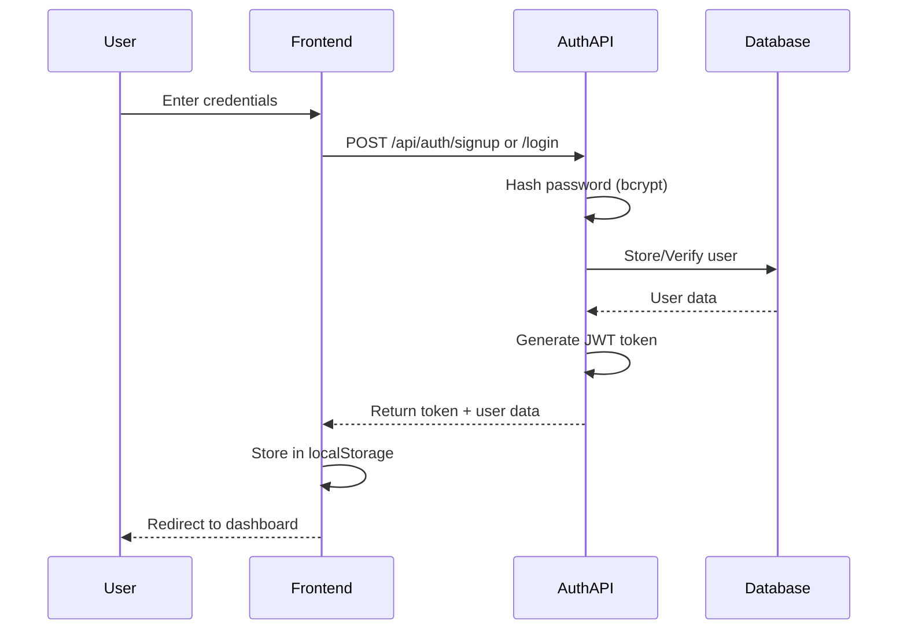
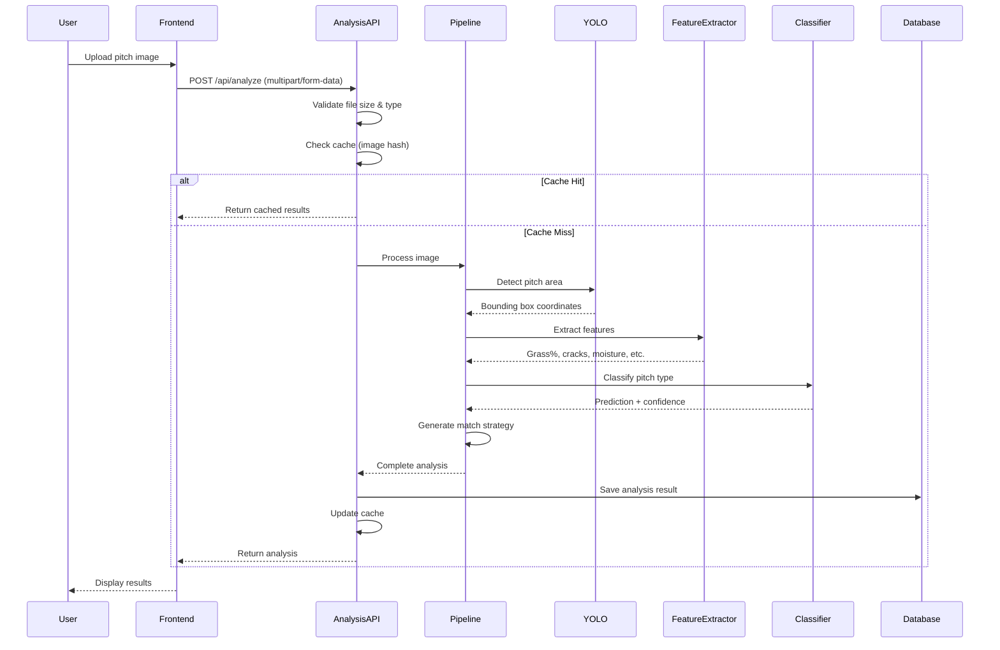
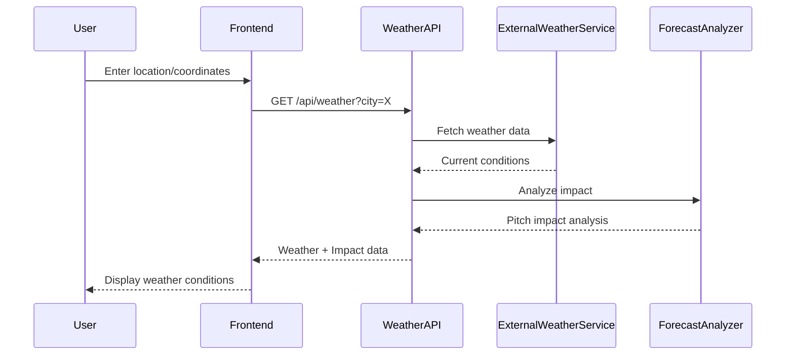
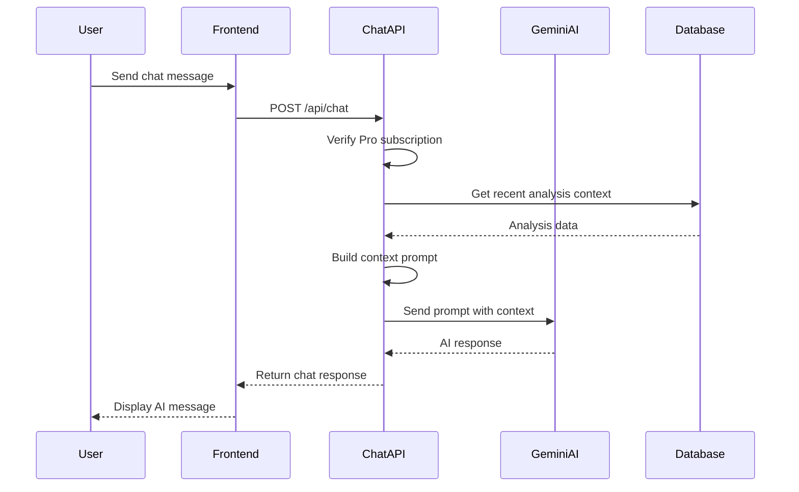
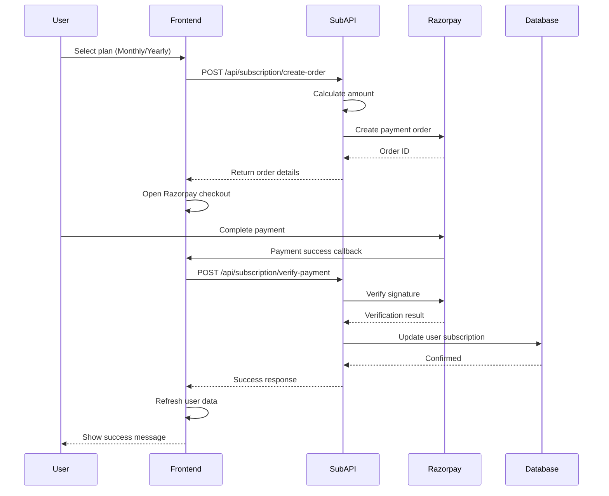

# Pitch Insight - Workflow Architecture

## System Overview
Pitch Insight is an AI-powered cricket pitch analysis application built with FastAPI (backend) and React (frontend), featuring machine learning models for pitch detection and classification, integrated with weather data and AI chatbot capabilities.

---

## Architecture Diagram



---

## Data Flow Workflows

### 1. User Authentication Flow


### 2. Pitch Analysis Workflow


### 3. Weather Integration Workflow


### 4. AI Chat Workflow


### 5. Subscription & Payment Workflow


---

## Component Details

### Frontend (React + Vite)
- **Framework**: React 18 with Vite for fast development
- **State Management**: React Hooks (useState, useEffect)
- **Routing**: Single-page application with component-based routing
- **API Communication**: Axios with interceptors for auth
- **Key Features**:
  - Authentication UI (Auth.jsx)
  - Image upload and analysis display
  - Chat widget integration
  - Subscription management
  - Analysis history

### Backend (FastAPI)
- **Framework**: FastAPI (async Python web framework)
- **Authentication**: JWT tokens with bcrypt password hashing
- **API Documentation**: Auto-generated Swagger/OpenAPI docs at `/docs`
- **Key Features**:
  - RESTful API design
  - CORS middleware for cross-origin requests
  - File upload handling
  - Async/await for concurrent operations
  - Environment-based configuration

### Database (MongoDB)
- **Collections**:
  - **users**: User accounts, subscriptions, payment history
  - **analysis**: Pitch analysis results and metadata
- **Indexes**:
  - Unique indexes on email and username
  - Query optimization for history retrieval
- **Data Storage**:
  - JSON documents for flexible schema
  - GridFS for large images (optional)

### ML Pipeline (ONNX)
- **Models**:
  - **YOLOv8 ONNX**: Pitch detection (640x640 input)
  - **Pitch Classifier ONNX**: Type classification (4 classes)
- **Processing Steps**:
  1. Image preprocessing (resize, normalize)
  2. YOLO inference for pitch detection
  3. Feature extraction (grass %, cracks, moisture, color)
  4. Classification with confidence scores
  5. Rule-based adjustments
  6. Strategy generation
- **Optimization**: ONNX Runtime for fast CPU inference

### External Integrations
- **Weather API** (weatherapi.com):
  - Current weather conditions
  - Location-based queries
  - Temperature, humidity, wind data
  
- **Gemini AI** (Google):
  - Cricket-specific chatbot
  - Context-aware responses
  - Analysis explanation
  
- **Razorpay**:
  - Payment processing
  - Subscription management
  - Webhook handling

---

## Security Features

1. **Authentication**:
   - JWT tokens with 7-day expiration
   - Bcrypt password hashing
   - Secure token storage (localStorage with HTTPS)

2. **Authorization**:
   - Route protection with dependency injection
   - Pro feature access control
   - User ownership validation

3. **API Security**:
   - CORS configuration
   - Request validation with Pydantic schemas
   - File upload restrictions (size, type)
   - Rate limiting (recommended for production)

4. **Data Protection**:
   - Environment variables for secrets
   - No hardcoded credentials
   - MongoDB authentication (production)

---

## Deployment Architecture

### Development
```
Frontend: localhost:5173 (Vite dev server)
Backend: localhost:8000 (Uvicorn)
Database: localhost:27017 (MongoDB)
```

### Production (Render)
```
Frontend: Nginx static hosting or Vercel
Backend: Render web service (Uvicorn workers)
Database: MongoDB Atlas
External Services: Cloud APIs
```

### Configuration
- **Environment Variables**: All sensitive data in `.env`
- **CORS**: Configured for specific origins in production
- **Keep-Alive**: `keep_alive.py` script to prevent service sleep

---

## Key Technologies

| Layer | Technologies |
|-------|-------------|
| Frontend | React, Vite, Axios, CSS3 |
| Backend | FastAPI, Uvicorn, Python 3.9+ |
| Database | MongoDB, PyMongo |
| ML/AI | ONNX Runtime, OpenCV, NumPy, Gemini AI |
| Authentication | JWT, bcrypt, python-jose |
| Payment | Razorpay SDK |
| Weather | WeatherAPI.com |
| Deployment | Render, Vercel, Docker |

---

## Performance Optimizations

1. **Caching**:
   - Image hash-based result caching
   - In-memory cache for frequent queries
   - Max cache size: 100 entries

2. **ONNX Runtime**:
   - Faster than PyTorch for inference
   - Optimized for CPU execution
   - Memory efficient (512MB compatible)

3. **Async Operations**:
   - FastAPI async endpoints
   - Concurrent request handling
   - Non-blocking I/O operations

4. **Frontend**:
   - Lazy loading components
   - Axios request interceptors
   - Local storage for user data

---

## API Endpoints Summary

### Authentication
- `POST /api/auth/signup` - Register new user
- `POST /api/auth/login` - User login
- `GET /api/auth/me` - Get current user
- `GET /api/auth/history` - Get analysis history

### Analysis
- `POST /api/analyze` - Upload and analyze pitch image
- `GET /api/analysis/{id}` - Get analysis by ID
- `DELETE /api/analysis/{id}` - Delete analysis

### Chat
- `POST /api/chat` - Send message to AI chatbot (Pro)

### Weather
- `GET /api/weather` - Get weather data by location
- `GET /api/weather/forecast-impact` - Get forecast impact analysis

### Subscription
- `POST /api/subscription/create-order` - Create payment order
- `POST /api/subscription/verify-payment` - Verify payment
- `GET /api/subscription/status` - Get subscription status

### Health
- `GET /api/health` - Health check endpoint

---

## Future Enhancements

1. **Real-time Features**:
   - WebSocket support for live match updates
   - Real-time chat notifications

2. **Advanced Analytics**:
   - Historical pitch performance tracking
   - Venue-specific analysis
   - Player performance correlation

3. **Mobile Optimization**:
   - Progressive Web App (PWA)
   - Mobile-specific UI improvements

4. **Scalability**:
   - Redis caching layer
   - CDN for static assets
   - Load balancing for API

---

**Generated**: February 2026  
**Version**: 2.0.0  
**Application**: Pitch Insight - AI-Powered Cricket Pitch Analysis
